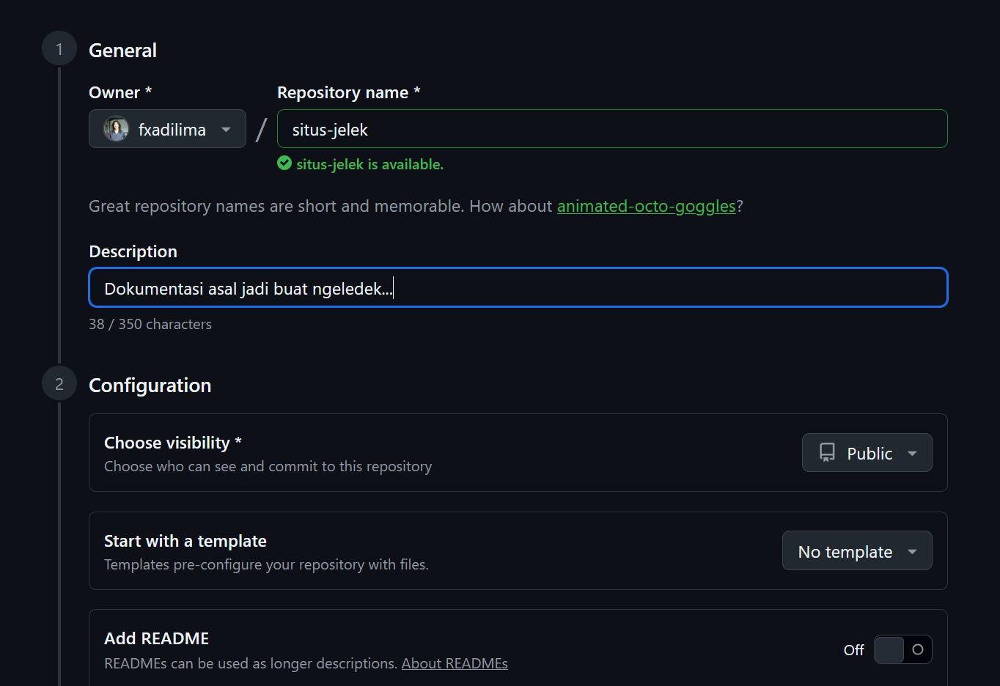

# Mengaktifkan GitHub Pages

Bagaimana cara kita mengaktifkan `GH Pages` kita, supaya semua dokumen kita secara otomatis bisa ditampilkan sebagai halaman Web tanpa mengharuskan teman-teman kita mengunjungi situs GitHub?

Mula-mula tentu saja kita harus menjadi member [GitHub](https://github.com), supaya kita punya `username` di situs itu. Biasanya akun kita akan bisa diakses sebagai "https://github.com/[username]". Tetapi jika kita ingin mendapatkan situs gratis dari `GitHub`, maka nantinya alamat yang diberikan adalah semacam "https://username.github.io", karena itu dari dalam GitHub kita perlu membuat sebuah repository dengan nama "username.github.io", di mana "username" ini adalah username Anda sendiri, yang bisa digunakan untuk `login` ke GitHub.

Jika sebelumnya Anda belum pernah membuat repository di GitHub, sebaiknya buat sekarang (gratis). Caranya sangat mudah:

1. Klik foto profile Anda di sebelah kanan atas situs GitHub, lalu klik "Repositories".
2. Setelah itu, klik tombol "New" yang berwarna hijau di kanan atas halaman itu.

